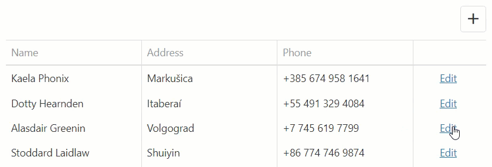

<!-- default badges list -->

<!-- default badges end -->
# DataGrid for DevExtreme - Update multiple cell values after selecting an item in a lookup column editor

This example demonstrates how to update multiple cell values after a user selects an item in the editor. In the example, when you select a new value in the "Name" column, the values in the "Address" and "Phone" columns also change.

## Implementation Details

- Define [onEditorPreparing](https://js.devexpress.com/Documentation/ApiReference/UI_Widgets/dxDataGrid/Configuration/#onEditorPreparing) to override the built-in `onValueChanged` event handler for a lookup column editor.
- Call the `setValue` method with the [selectedItem](https://js.devexpress.com/Documentation/ApiReference/UI_Widgets/dxSelectBox/Configuration/#selectedItem) option as a parameter to pass changes to the grid.  
- Define the [setCellValue](https://js.devexpress.com/Documentation/ApiReference/UI_Widgets/dxDataGrid/Configuration/columns/#setCellValue) callback function in a lookup column and use the `newData` parameter to update adjacent cells. The `value` parameter represents an item you have selected.

## Files to Review

- **jQuery**
    - [index.js](jQuery/index.js)    
- **Angular**
    - [app.component.html](Angular/src/app/app.component.html)
    - [app.component.ts](Angular/src/app/app.component.ts)  
- **Vue**
    - [App.vue](Vue/src/App.vue)
- **React**
    - [App.js](React/src/App.js)
- **ASP.NET**    
    - [Index.cshtml](ASP.NET/Views/Home/Index.cshtml)

## Documentation

- [Getting Started with DataGrid](https://js.devexpress.com/Documentation/Guide/UI_Components/DataGrid/Getting_Started_with_DataGrid/)
- [DataGrid API - setCellValue](https://js.devexpress.com/Documentation/ApiReference/UI_Widgets/dxDataGrid/Configuration/columns/#setCellValue)

## More Examples

- [DataGrid for DevExtreme - Display tooltip for data cells](https://github.com/DevExpress-Examples/devextreme-datagrid-display-tooltip-for-data-cells)
- [DataGrid for DevExtreme - How to allow users select multiple cells](https://github.com/DevExpress-Examples/devextreme-datagrid-multiple-cell-selection)

